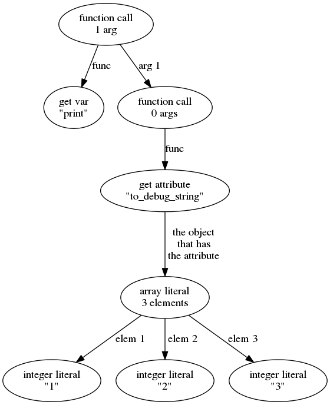

# Syntax Specification

This page defines the Ö syntax that the interpreter can execute. If you are
interested in writing your own alternative to my Ö interpreter, you came to the
right place. You might be also interested in this stuff if you just want to
know how my Ö interpreter works.


## Tokenizing

The first step with running any code is tokenizing it. It means taking code
like this...

```python
print ([1 2 3].to_debug_string);
```

...and turning it into a bunch of tokens. The above code would be tokenized
like this:

| Token kind        | Value             |
| ----------------- | ----------------- |
| identifier        | `print`           |
| operator          | `(`               |
| operator          | `[`               |
| integer literal   | `1`               |
| integer literal   | `2`               |
| integer literal   | `3`               |
| operator          | `]`               |
| operator          | `.`               |
| identifier        | `to_debug_string` |
| operator          | `)`               |
| operator          | `;`               |

Some notes:
- The code is far from runnable after tokenizing it; tokenizing is just the
  very first step.
- Each token must have at least a kind and a value string, but it's best to
  also include line number information in the tokens. That is needed when
  displaying stack traces. The interpreter doesn't display stack traces right
  now, but it's on [the huge todo list](../TODO.md).
- The Ö tokenizer ignores all Unicode whitespace (e.g. spaces, tabs, newlines)
  except when the whitespace is in a string (`"hello world"` is not same as
  `"helloworld"`) or the whitespace separates tokens that would be parsed
  differently without the whitespace (`1 2` is two tokens, and `12` is one
  token). This means that `f"a"2b;` is a valid way to write `f "a" 2 b;`.

Here's a list of *all* supported kinds of tokens:
- A `#` character begins a *comment*, and a newline or end-of-file ends the
  comment. The Ö interpreter doesn't actually create comment tokens at all;
  it's not possible to access tokens directly from Ö code and the comment
  tokens would need to be ignored anyway, so it's not possible to write Ö code
  that actually notices the difference.
- *String literals* are any characters except `"` or newline between `"`
  quotes. There are no escape sequences yet, not even `\n` :(
- *Identifiers* are names of e.g. variables and methods. They can contain any
  alphabetical Unicode characters as well as any of the characters
  `_0123456789`. An identifier cannot start with any of the characters
  `0123456789`; code like `123asd` should be parsed as two tokens, `123` and
  `asd`.
- *Non-negative integer literals* are characters `0123456789` jammed together
  in different ways. The literal must not start with `0`, but *just* `0` is a
  valid integer literal. Things like `0123` are invalid syntax, *not* two
  separate tokens; this is because some other programming languages give a
  special meaning to integer literals starting with 0 and `0123 != 123`, and
  trying to do that in Ö must not silently give unexpected results.
- *Negative integer literals* are `-` immediately followed by a non-negative
  integer literal. This definition means that `-0` is a valid alternative to
  `0`. I'm not sure if this is a good thing or if the Ö interpreter does it
  right now (I'm tired and I don't feel like trying it out). I might change
  this later.
- *Operators* are `{`, `}`, `[`, `]`, `(`, `)`, `=`, `;`, `:`, `.`  or `` ` ``.
- `var` is parsed with similar rules as identifiers, but it's best for the
  tokenizer to output `var` tokens as non-identifiers. This way `thing.var`
  will cause errors when parsing to AST. Note that e.g. `var_statement` and
  `var0` are valid identifiers.

Anything else should throw an error. It's good if the error messages are
descriptive, but there's no exact specification of what they need to say.

The token rule that matches *first* should be used. For example,
`"hello # world"` is not a comment because the very first character begins a
valid string literal, and the `#` beginning a comment is the 8th character.

There are no float objects in the whole language yet, so `0.0` should be
tokenized as two integers and an operator (even though parsing those will
fail because `.` must be followed by an identifier).


## Parsing to AST

The parser takes tokens as input and outputs
[AST](https://en.wikipedia.org/wiki/Abstract_syntax_tree) nodes. For example,
this thing we tokenized above...

```python
print ([1 2 3].to_debug_string);
```

...produces an AST tree like this:



Each ball in the above drawing must be available as an `AstNode` object in Ö.
`AstNode` objects don't have any attributes yet, so they are essentially
useless. This will hopefully be fixed some day...

`Block` objects have an `ast_statements` attribute that is set to an array of
`AstNode` objects representing statements. The `AstNode` class itself is not in
[the built-in scope](tutorial.md#scopes), but it's not hidden either; when a
function for getting the class of an instance will be added, it will be
possible to access the `AstNode` class like this:

```python
var print_statement = ({ print "hello"; }.ast_statements.get 0);
var AstNode = (magic_function_that_gets_the_class print_statement);
```

Ast nodes can represent two things:
- A statement is anything that ends with a `;`, like `print "hello";`. The
  1-arg function call in the above drawing is a statement.
- An expression is anything that returns a value. All other AST nodes in the
  above drawing represent expressions.

Here's a list of all supported kinds of expressions:
- String literals: `""` and `"hello"` return `String` objects.
- Integer literals: `123`, `-5` and `0` return `Integer` objects.
- Variable lookups: `print` and `magic_number` return values of variables.
  Variable names must be identifiers.
- Attribute lookups: `expr.attr` returns the `attr` attribute of the object
  returned by the `expr` expression. `attr` must be an identifier.
- List literals: `[element1 element2 element3]` and `[]` return `List` objects.
  The elements can be any expressions.
- Function call expressions: `(function arg1 arg2 arg3)` calls the function
  with the given arguments and returns whatever the function returned. The
  function and the arguments can be any expressions, and you can have any
  number of arguments you want. The argument list can also contain options
  given like `name:value` where `name` is an identifier and `value` is an
  expression. Giving two or more options with same names is a syntax error.
  Unlike in e.g. C, options and arguments must be evaluated in order, from left
  to right.
- Infixed function call expressions: ``(arg1 `function` arg2)`` is equivalent
  to `(function arg1 arg2)`. Here `func`, `arg1` and `arg2` can be any
  expressions. There must be exactly 2 arguments and no options.
- Blocks: `{ statement1; statement2; }` returns a block object. You can have
  any number of [statements](#statements) inside the block you want. `{ }` is a
  block that does nothing, and `{ expression }` without a `;` is equivalent to
  `{ return expression; }`. However, `{ statement; expression }` is a syntax
  error.
  TODO: the Ö interpreter doesn't support the `{ expression }` syntax yet :(

Here's a list of statements:
- Function calls: `function arg1 arg2 arg3;` is like the
  `(function arg1 arg2 arg3)` [expression](#expressions), but the return value
  is ignored. Arguments and options are treated the same way.
- Infixed function calls: ``arg1 `function` arg2;`` is equivalent to
  `function arg1 arg2;`.
- Variable creation: `var a = b;` sets the variable `a` to `b` **locally**.
  `a` can be any identifier, and `b` can be any expression.
- Assignments: `a = b;` is like `var a = b;`, but it sets the variable
  **wherever it's defined**. See [scope stuff in the tutorial](tutorial.md#scopes)
  for details.
- Setting attributes: `a.b = c;` sets the `b` attribute of `a` to `c`. `b` must
  be an identifier, and `a` and `c` can be any expressions.

When parsing a file or the content of a `Block`, the parser simply parses the
tokens statement by statement until there are no more tokens left. The
statement array is the result of the parsing, and usually it ends up being
executed statement by statement or saved to an `ast_statements` attribute of a
`Block`.


## Running the AST

Some interpreters (e.g. cpython) create bytecode from the AST, write it to a
file and run that. This speeds things up when many files must be loaded on
startup because there's no need to go through the tokenizing and parsing every
time, only if the cached bytecode is older than the source file. The Ö
interpreter could do something like that, but right now it just runs the AST as
is.

The Ö interpreter does these things on startup:

1. Create [the built-in scope](tutorial.md#scopes). The `parent_scope` should be
   set to `null`.
2. Add everything that `builtins.ö` needs to the built-in scope. It's best to
   read `builtins.ö` yourself to see which things it expects to have there
   already and which things it creates.
3. Tokenize and parse `builtins.ö`, and execute it in the built-in scope.
4. Create a new subscope of the built-in scope for the file that is being ran.
5. Tokenize and parse the file, and execute it in the subscope.

Some of these things are not as simple as they sound like. For example, the
first step is creating a `Scope` object, but for that we need to have the
`Scope` class. Then, for the `Scope` class we need to have the `Class` class;
that is, the `Scope` class is a `Class` object. But for the `Class` class we
need the `Object` class because every class inherits from `Object`, but
`Object` should also be a `Class` instance because it's a class even though
`Class` wasn't supposed to exist yet... You get the idea. If you are writing an
Ö interpreter, you can solve these problems however you want to.
